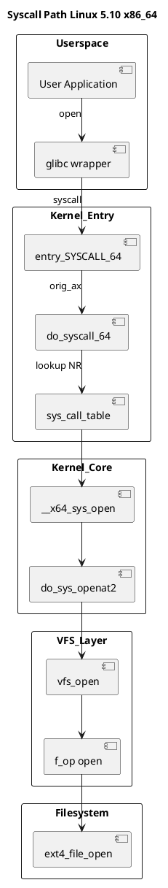
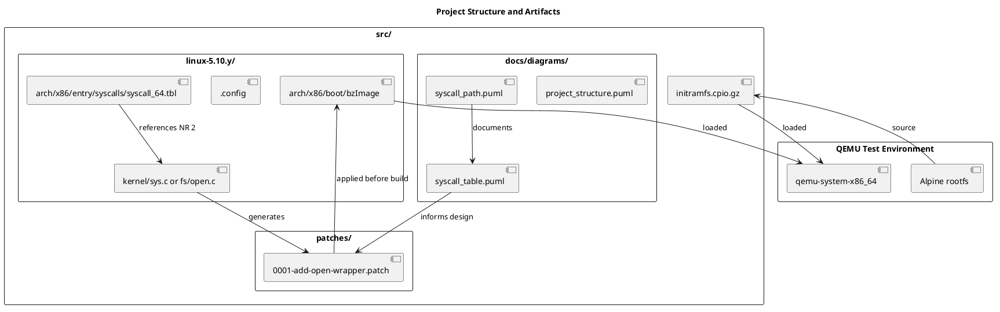

# Linux System Call Wrapper Project

Учебный проект по модификации системного вызова \`open\` в ядре Linux 5.10.

## Что реализовано

1. **Сборка ядра 5.10.235** с исправлениями для GCC 15/C23
2. **Обёртка sys_open** с логированием в kernel log (\`dmesg\`)
3. **UML-диаграммы** архитектуры системных вызовов
4. **Smoke-тест** в QEMU с KVM

## Структура

```
patches/
└── 0001-add-open-wrapper.patch    # Unified diff для fs/open.c
docs/diagrams/
├── syscall_path.puml/png          # Путь от userspace до VFS
├── syscall_table.puml/png         # Таблица системных вызовов
└── project_structure.puml/png     # Артефакты проекта
src/
└── kernel-config                  # .config для воспроизводимой сборки
```

## Диаграммы

### Путь системного вызова


### Структура проекта


## Лицензия
GPL-2.0 (патчи для ядра)

## Run from Container Registry

```bash
docker run --rm -it --device /dev/kvm ghcr.io/valuncilh/syscall-wrapper-linux:5.10.235
```

After boot, inside the guest:
```
cat /etc/alpine-release
dmesg | grep MY_OPEN
```

Exit QEMU: `Ctrl-A` then `X`.


## Run from Container Registry

```bash
docker run --rm -it --device /dev/kvm ghcr.io/valuncilh/syscall-wrapper-linux:5.10.235
```

After boot, inside the guest:
```sh
cat /etc/alpine-release
dmesg | grep MY_OPEN
```

Exit QEMU: `Ctrl-A` then `X`.
