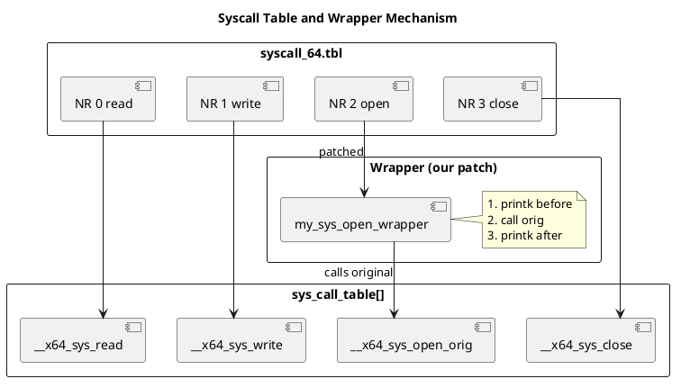

# Linux System Call Wrapper Project

Учебный проект по модификации системного вызова \`open\` в ядре Linux 5.10.

## Что реализовано

1. **Сборка ядра 5.10.235** с исправлениями для GCC 15/C23
2. **Обёртка sys_open** с логированием в kernel log (\`dmesg\`)
3. **UML-диаграммы** архитектуры системных вызовов
4. **Smoke-тест** в QEMU с KVM

## Структура

\`\`\`
patches/
└── 0001-add-open-wrapper.patch    # Unified diff для fs/open.c
docs/diagrams/
├── syscall_path.puml/png          # Путь от userspace до VFS
├── syscall_table.puml/png         # Таблица системных вызовов
└── project_structure.puml/png     # Артефакты проекта
src/
└── kernel-config                  # .config для воспроизводимой сборки
\`\`\`

## Быстрый старт

### 1. Скачай ядро
\`\`\`bash
wget https://cdn.kernel.org/pub/linux/kernel/v5.x/linux-5.10.235.tar.xz
tar xf linux-5.10.235.tar.xz
ln -s linux-5.10.235 linux-5.10.y
\`\`\`

### 2. Примени патчи для GCC 15 (если используешь современный компилятор)
\`\`\`bash
# См. раздел "Известные проблемы" ниже
\`\`\`

### 3. Примени патч обёртки
\`\`\`bash
cd linux-5.10.y
patch -p1 < ../patches/0001-add-open-wrapper.patch
\`\`\`

### 4. Собери
\`\`\`bash
cp ../src/kernel-config .config
make olddefconfig
make -j\$(nproc) bzImage modules
\`\`\`

### 5. Запусти в QEMU
\`\`\`bash
# Создай initramfs из Alpine mini rootfs
wget https://dl-cdn.alpinelinux.org/alpine/v3.19/releases/x86_64/alpine-minirootfs-3.19.1-x86_64.tar.gz
mkdir rootfs && tar xzf alpine-minirootfs-*.tar.gz -C rootfs
echo -e "#!/bin/sh\nmount -t proc none /proc\nmount -t sysfs none /sys\nmount -t devtmpfs none /dev\necho SMOKE TEST\nuname -r\nexec /bin/sh" > rootfs/init
chmod +x rootfs/init
cd rootfs && find . | cpio -o -H newc | gzip > ../initramfs.cpio.gz

qemu-system-x86_64 \
    -enable-kvm \
    -kernel ../linux-5.10.y/arch/x86/boot/bzImage \
    -initrd ../initramfs.cpio.gz \
    -append "console=ttyS0 init=/init" \
    -nographic
\`\`\`

### 6. Проверь логи
Внутри гостя:
\`\`\`sh
cat /etc/alpine-release
dmesg | grep MY_OPEN
\`\`\`

Ожидаемый вывод:
\`\`\`
[   X.XXXXXX] [MY_OPEN] pid=67 comm=cat path=/etc/alpine-release flags=0x8000
\`\`\`

## Известные проблемы

### GCC 15 / C23 compatibility
Ядро 5.10 не совместимо с GCC 15 из-за изменений в C23 (\`bool\`, \`true\`, \`false\` стали ключевыми словами).

**Fix для \`include/linux/stddef.h\`**:
\`\`\`c
#if defined(__STDC_VERSION__) && __STDC_VERSION__ >= 202311L
/* C23: false/true are keywords */
#else
enum {
    false   = 0,
    true    = 1
};
#endif
\`\`\`

**Fix для \`include/linux/types.h\`**:
\`\`\`c
#if defined(__STDC_VERSION__) && __STDC_VERSION__ >= 202311L
/* C23: bool is a keyword */
#else
typedef _Bool bool;
#endif
\`\`\`

## Диаграммы

### Путь системного вызова

### Таблица системных вызовов

### Структура проекта

## Лицензия
GPL-2.0 (патчи для ядра)

## Run from Container Registry

\`\`\`bash
docker run --rm -it --device /dev/kvm ghcr.io/valuncilh/syscall-wrapper-linux:5.10.235
\`\`\`

After boot, inside the guest:
\`\`\`sh
cat /etc/alpine-release
dmesg | grep MY_OPEN
\`\`\`

Exit QEMU: \`Ctrl-A\` then \`X\`.

## Run from Container Registry

\`\`\`bash
docker run --rm -it --device /dev/kvm ghcr.io/valuncilh/syscall-wrapper-linux:5.10.235
\`\`\`

After boot, inside the guest:
\`\`\`sh
cat /etc/alpine-release
dmesg | grep MY_OPEN
\`\`\`

Exit QEMU: \`Ctrl-A\` then \`X\`.
